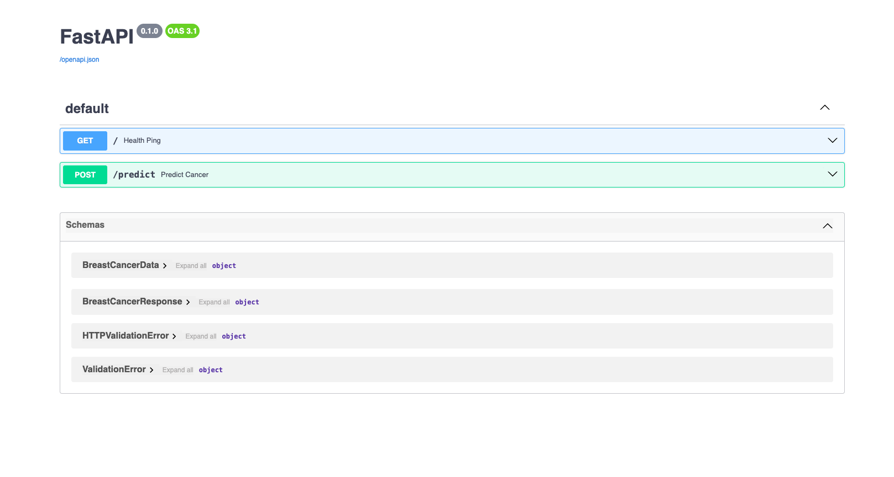
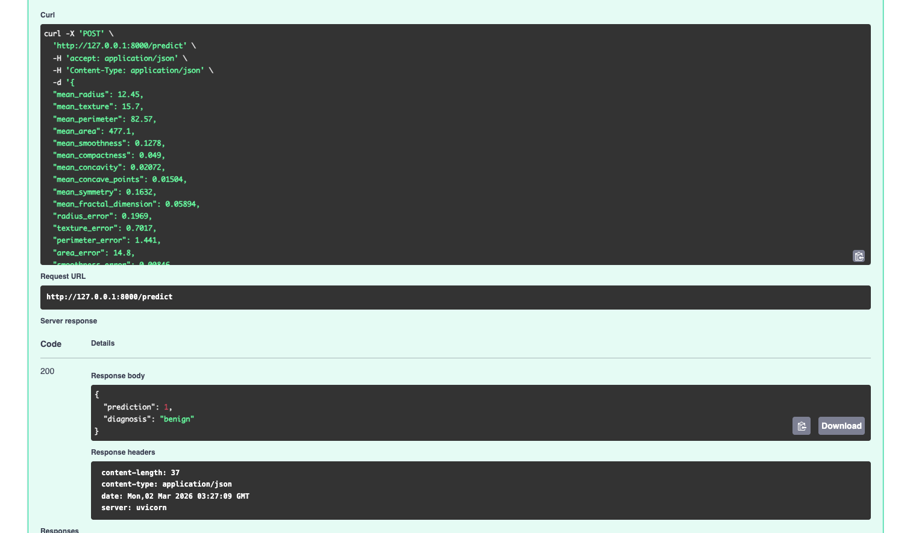

---
- Video Explanation: [FastAPI lab](https://www.youtube.com/watch?v=KReburHqRIQ&list=PLcS4TrUUc53LeKBIyXAaERFKBJ3dvc9GZ&index=4)
- Blog: [FastAPI Lab-1](https://www.mlwithramin.com/blog/fastapi-lab1)

---

## Overview

In this Lab, I learn't how to expose ML models as APIs using [FastAPI](https://fastapi.tiangolo.com/) and [uvicorn](https://www.uvicorn.org/).

The workflow involves the following steps:
1. Training a Random Forest Classifier on the Breast Cancer Wisconsin Dataset.
2. Serving the trained model as an API using FastAPI and uvicorn.

## Setting up the Lab

1. Create a virtual environment (e.g. **fastapi_lab1_env**).
2. Activate the environment and install the required packages using `pip install -r requirements.txt`.

### Project Structure

```
fastapi_lab1
├── assets/
├── model/
│   └── breast_cancer_model.pkl
├── src/
│   ├── __init__.py
│   ├── data.py
│   ├── main.py
│   ├── predict.py
│   └── train.py
├── README.md
└── requirements.txt
```

### Dependencies (`requirements.txt`)

| Package | Version | Purpose |
|---------|---------|---------|
| `scikit-learn` | 1.5.1 | Model training (Random Forest) and dataset loading |
| `fastapi[all]` | 0.111.1 | Web framework for serving the API (includes `uvicorn`) |

## Running the Lab

1. Move into the **src/** folder:
    ```bash
    cd src
    ```
2. Train the Random Forest Classifier:
    ```bash
    python train.py
    ```
3. Serve the trained model as an API:
    ```bash
    uvicorn main:app --reload
    ```
4. Open the interactive API docs at [http://127.0.0.1:8000/docs](http://127.0.0.1:8000/docs) to test endpoints.





---

## Code Walkthrough

### `data.py` — Data Loading & Splitting

This module handles loading the dataset and splitting it into train/test sets.

```python
def load_data():
    cancer = load_breast_cancer()  # loads sklearn's built-in dataset
    X = cancer.data               # 30 numeric features (numpy array)
    y = cancer.target             # labels: 0 = malignant, 1 = benign
    return X, y

def split_data(X, y):
    # 70/30 train-test split with a fixed random seed for reproducibility
    X_train, X_test, y_train, y_test = train_test_split(X, y, test_size=0.3, random_state=42)
    return X_train, X_test, y_train, y_test
```

- `load_data()` uses `sklearn.datasets.load_breast_cancer()` to fetch the Breast Cancer Wisconsin dataset (569 samples, 30 features each).
- `split_data()` performs a 70/30 train-test split using `train_test_split` with `random_state=42` for reproducibility.

---

### `train.py` — Model Training

This module trains the classifier and persists it to disk.

```python
def fit_model(X_train, y_train):
    rf_classifier = RandomForestClassifier(n_estimators=100, max_depth=5, random_state=42)
    rf_classifier.fit(X_train, y_train)
    joblib.dump(rf_classifier, "../model/breast_cancer_model.pkl")
```

- Creates a **Random Forest Classifier** with 100 trees and max depth of 5.
- Serializes the trained model to `model/breast_cancer_model.pkl` using `joblib`.
- The `if __name__ == "__main__"` block chains `load_data()` → `split_data()` → `fit_model()` so running `python train.py` executes the full training pipeline.

---

### `predict.py` — Model Inference

This module loads the saved model and runs predictions on new data.

```python
def predict_data(X):
    model = joblib.load("../model/breast_cancer_model.pkl")
    y_pred = model.predict(X)
    return y_pred  # 0 = malignant, 1 = benign
```

- `predict_data()` loads the persisted `.pkl` model from disk on every call and returns the predicted class labels.

---

### `main.py` — FastAPI Application

This is the entry point of the API. It defines the data models and two endpoints.

#### Data Models (Pydantic)

| Model | Purpose |
|-------|---------|
| `BreastCancerData(BaseModel)` | Validates incoming request body — expects all 30 float features from the dataset |
| `BreastCancerResponse(BaseModel)` | Shapes the response — returns `prediction` (int) and `diagnosis` (str) |

#### API Endpoints

##### `GET /` — Health Check
```python
@app.get("/", status_code=status.HTTP_200_OK)
async def health_ping():
    return {"status": "healthy"}
```
Returns `{"status": "healthy"}` to confirm the server is running.

##### `POST /predict` — Breast Cancer Prediction
```python
@app.post("/predict", response_model=BreastCancerResponse)
async def predict_cancer(cancer_features: BreastCancerData):
    features = [[cancer_features.mean_radius, ...]]  # 30 features as a 2D list
    prediction = predict_data(features)
    diagnosis = "benign" if prediction[0] == 1 else "malignant"
    return BreastCancerResponse(prediction=int(prediction[0]), diagnosis=diagnosis)
```

- Accepts a JSON body matching the `BreastCancerData` schema (30 float fields).
- Extracts the features into a 2D list (the shape `sklearn` expects) and passes them to `predict_data()`.
- Maps the numeric prediction to a human-readable diagnosis: **1 → benign**, **0 → malignant**.
- Wraps the error handling in a `try/except` block — any unexpected error returns an **HTTP 500** with the exception detail.

---

## Request/Response Example

**Request** (`POST /predict`):
```json
{
  "mean_radius": 17.99,
  "mean_texture": 10.38,
  "mean_perimeter": 122.8,
  "mean_area": 1001.0,
  "mean_smoothness": 0.1184,
  "mean_compactness": 0.2776,
  "mean_concavity": 0.3001,
  "mean_concave_points": 0.1471,
  "mean_symmetry": 0.2419,
  "mean_fractal_dimension": 0.07871,
  "radius_error": 1.095,
  "texture_error": 0.9053,
  "perimeter_error": 8.589,
  "area_error": 153.4,
  "smoothness_error": 0.006399,
  "compactness_error": 0.04904,
  "concavity_error": 0.05373,
  "concave_points_error": 0.01587,
  "symmetry_error": 0.03003,
  "fractal_dimension_error": 0.006193,
  "worst_radius": 25.38,
  "worst_texture": 17.33,
  "worst_perimeter": 184.6,
  "worst_area": 2019.0,
  "worst_smoothness": 0.1622,
  "worst_compactness": 0.6656,
  "worst_concavity": 0.7119,
  "worst_concave_points": 0.2654,
  "worst_symmetry": 0.4601,
  "worst_fractal_dimension": 0.1189
}
```

**Response**:
```json
{
  "prediction": 0,
  "diagnosis": "malignant"
}
```
